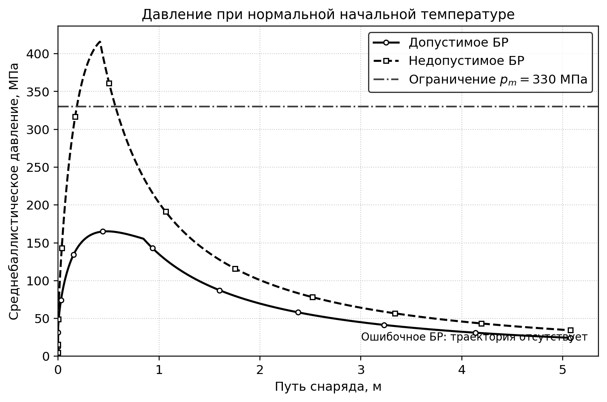
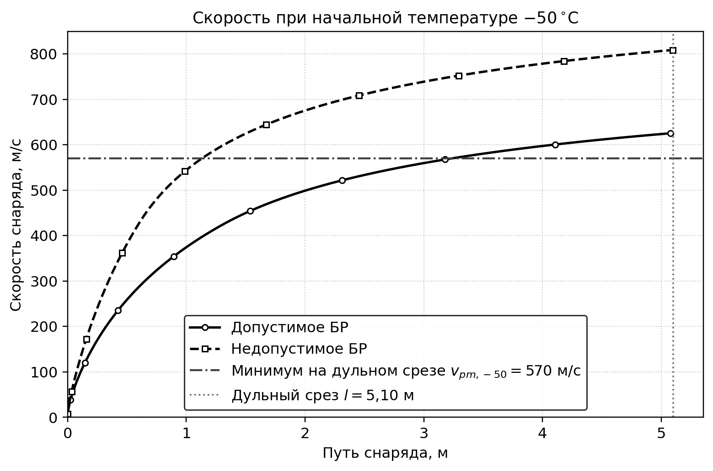
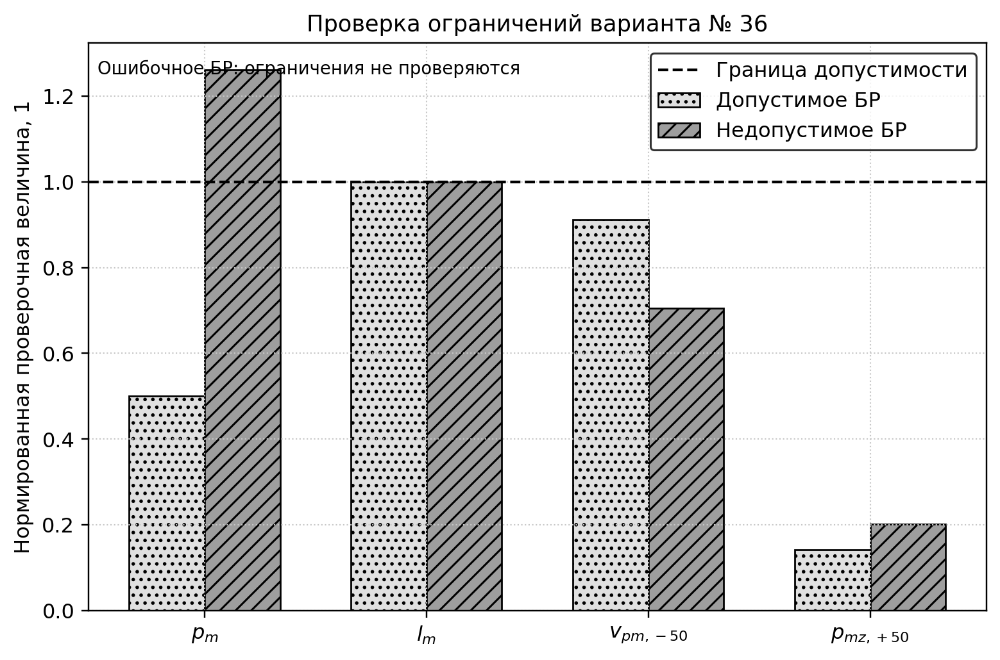
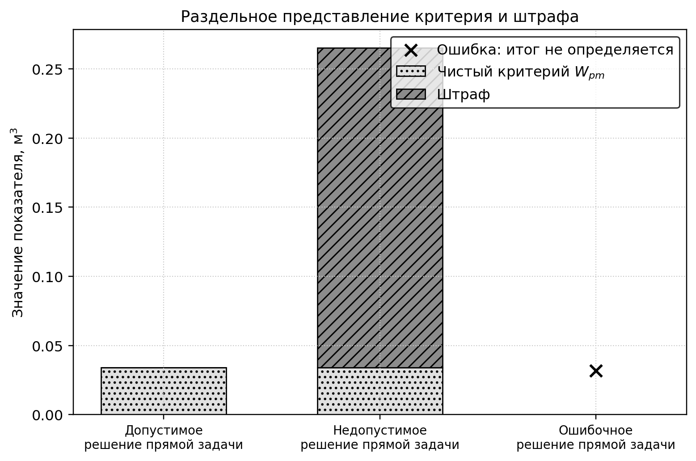

<div class="title-page">

<div class="title-organization">

**ОБРАЗОВАТЕЛЬНАЯ ОРГАНИЗАЦИЯ: ______________________________**  
**КАФЕДРА / ПОДРАЗДЕЛЕНИЕ: _________________________________**

</div>

<div class="title-main">

**ЛАБОРАТОРНАЯ РАБОТА № 1**  
по дисциплине «Информационные технологии при проектировании РиСО»

**Markdown, LaTeX и воспроизводимый отчёт  
по прямому баллистическому расчёту**

Вариант № 36

</div>

<div class="title-authors">

Выполнил: студент группы __________  
**Андрей Барышев**

Проверил: __________________________

</div>

<div class="title-city">____________________ — 2026</div>

</div>

# ВВЕДЕНИЕ {.structural}

Цель лабораторной работы — разработать воспроизводимую программу прямого
расчёта внутренней баллистики для варианта № 36, проверить вычисление критерия,
ограничений и штрафа, а также исследовать поведение программы на допустимом,
недопустимом и ошибочном баллистических решениях. Расчёт выполняется нульмерной
термодинамической моделью библиотеки `pyballistics` версии 1.2.1. Исходные данные
варианта взяты из методического пособия [1], требования к исследованию — из
задания на лабораторную работу [2].

Работа ограничена прямой баллистической задачей. Поиск оптимального решения и
сравнение оптимизаторов не выполняются. Марка и масса метательного заряда
используются как параметры отдельных контрольных решений, а не как найденный
оптимум.

# 1 Вариант и организация расчётов {.section}

## 1.1 Исходные данные и математическая постановка

В таблице 1 приведены исходные данные варианта № 36. В программном коде все
величины хранятся в единицах СИ; в таблицах результатов давление дополнительно
переведено в мегапаскали для читаемости.

<div class="table-title">Таблица 1 — Исходные данные варианта № 36</div>

| Величина | Обозначение | Значение |
|---|:---:|---:|
| Калибр орудия | $d$ | $0{,}085$ м |
| Масса снаряда | $q$ | $9{,}54$ кг |
| Требуемая дульная скорость | $v_{pm}$ | $650$ м/с |
| Тип орудия | — | нарезное |
| Модель внутренней баллистики | — | нульмерная |
| Давление воспламенителя | $p_{ign\_0}$ | $5{,}0\cdot10^6$ Па |
| Давление форсирования | $p_0$ | $3{,}0\cdot10^7$ Па |
| Марка основного пороха | — | `8/1 тр` |

Методическое пособие не назначает варианту конкретную марку основного пороха,
поэтому для контрольных решений выбрана марка `8/1 тр` из базы
`pyballistics`. Порохом-воспламенителем является ДРП. Начальный объём каморы
принят равным $W_0=4{,}0\cdot10^{-3}$ м³, коэффициент фиктивности массы снаряда
$\varphi_1=1{,}02$, нормальная температура $T_0=293{,}15$ К.

Чистый критерий представляет объём канала ствола вместе с каморой и вычисляется
по формуле (1):

$$
W_{pm}=W_0+Sl, \qquad S=0{,}26\pi d^2. \qquad \text{(1)}
$$

где $W_{pm}$ — критерий, м³; $W_0$ — начальный объём каморы, м³; $S$ — площадь
поперечного сечения канала, м²; $l$ — длина хода снаряда до дульного среза, м;
$d$ — калибр, м. Направление улучшения критерия — минимизация.

Для варианта проверяется система ограничений (2):

$$
\begin{aligned}
p_m(293{,}15\,\mathrm{K}) &\le 3{,}30\cdot10^8\ \mathrm{Па},\\
l_m &\le 60d=5{,}10\ \mathrm{м},\\
v_{pm}(223{,}15\,\mathrm{K}) &\ge 570\ \mathrm{м/с},\\
p_{mz}(323{,}15\,\mathrm{K}) &\le 1{,}70\cdot10^8\ \mathrm{Па}.
\end{aligned} \qquad \text{(2)}
$$

где $p_m$ — максимальное среднебаллистическое давление; $l_m$ — длина ведущей
части канала; $v_{pm}$ — дульная скорость; $p_{mz}$ — дульное
среднебаллистическое давление. Температуры 223,15 К и 323,15 К соответствуют
условиям $-50\,^{\circ}$C и $+50\,^{\circ}$C.

## 1.2 Организация безопасного прямого расчёта

Функция `run_ballistics_safe` формирует словарь параметров и вызывает
`pyballistics.ozvb_termo`. Вызов находится внутри `try-except`. Помимо
исключений проверяются статус библиотеки, наличие обязательных массивов
`t`, `x_p`, `v_p`, `p_m`, одинаковая длина расчётных слоёв и конечность всех
чисел. Наличие `NaN` или `inf`, преждевременная остановка либо недостижение
дульного среза дают статус «ошибка» с диагностическим сообщением.

Для рассчитанного решения возвращаются дульная скорость, максимальное и
дульное давления, причина остановки и все массивы траектории. Статус прямого
расчёта не содержит оценки допустимости. Поэтому физически рассчитанное решение
с превышением давления не смешивается с ошибкой численного метода.

Функция `evaluate_ballistic_solution` вызывает решатель при трёх начальных
температурах: 293,15 К, 223,15 К и 323,15 К. Если хотя бы один вызов ошибочен,
ограничения не проверяются, признак допустимости, штраф и итоговый показатель не
назначаются.

## 1.3 Штрафная функция

Ограничения имеют разные размерности, поэтому перед объединением вычисляется
безразмерное нарушение. Для верхней и нижней границ используются формулы (3):

$$
r_i=
\begin{cases}
\max\!\left(0,\dfrac{g_i-g_i^{\max}}{g_i^{\max}}\right),
& g_i\le g_i^{\max},\\[6pt]
\max\!\left(0,\dfrac{g_i^{\min}-g_i}{g_i^{\min}}\right),
& g_i\ge g_i^{\min}.
\end{cases} \qquad \text{(3)}
$$

где $g_i$ — рассчитанное значение; $g_i^{\max}$ или $g_i^{\min}$ — предел;
$r_i$ — нормированное нарушение. При выполненном ограничении $r_i=0$.

Изолированная квадратичная штрафная функция и итоговый показатель определены
формулами (4) и (5):

$$
P=\alpha W_{pm}\sum_{i=1}^{4}r_i^2, \qquad \alpha=100. \qquad \text{(4)}
$$

$$
J=W_{pm}+P. \qquad \text{(5)}
$$

где $P$ — штраф, м³; $\alpha$ — безразмерный коэффициент масштаба; $J$ —
штрафованный показатель, м³. Значения $W_{pm}$ и $P$ хранятся раздельно.
Ошибка прямого расчёта не получает искусственного бесконечного штрафа: для неё
$P$ и $J$ не определяются.

## 1.4 Замысел вычислительной проверки

Выбраны три сценария. Допустимое решение должно подтвердить нулевой штраф.
Недопустимое решение использует увеличенную массу заряда и проверяет обнаружение
превышения давления. Ошибочное решение содержит отрицательную массу заряда и
проверяет безопасную обработку отказа библиотеки. Оно запускается между двумя
рассчитываемыми сценариями, поэтому успешное выполнение последнего сценария
подтверждает продолжение программы после ошибки.

Профили давления и скорости показывают ход прямого расчёта и соответствующие
границы. Нормированные столбцы позволяют совместно проверить все четыре
разноразмерных ограничения. Отдельная диаграмма критерия и штрафа подтверждает,
что чистый критерий не заменяется штрафованным значением.

# 2 Контрольные решения и результаты {.section}

## 2.1 Выбранные решения

Назначение и параметры контрольных решений приведены в таблице 2. Отрицательная
масса в третьей строке является намеренно ошибочным программным входом, а не
физическим вариантом заряжания.

<div class="table-title">Таблица 2 — Контрольные баллистические решения</div>

| Сценарий | Марка пороха | Масса заряда, кг | $W_0$, м³ | $l$, м | Назначение |
|---|:---:|---:|---:|---:|---|
| Допустимое БР | `8/1 тр` | 1,350 | 0,004000 | 5,10 | Проверка нулевого штрафа |
| Недопустимое БР | `8/1 тр` | 2,000 | 0,004000 | 5,10 | Превышение давления |
| Ошибочное БР | `8/1 тр` | −1,000 | 0,004000 | 5,10 | Контролируемая ошибка входа |

## 2.2 Численные результаты

Основные результаты сведены в таблицу 3. Тире означает, что величина не
определялась вследствие ошибки прямого расчёта. Геометрический чистый критерий
для ошибочного входа вычислим, но не превращает этот вход в баллистическое
решение.

<div class="table-title">Таблица 3 — Результаты проверки сценариев</div>

| Сценарий | $p_m$, МПа | $v_{pm,-50}$, м/с | $p_{mz,+50}$, МПа | $W_{pm}$, м³ | $P$, м³ | $J$, м³ | Допустимость |
|---|---:|---:|---:|---:|---:|---:|:---:|
| Допустимое БР | 165,201 | 625,758 | 24,228 | 0,034098 | 0,000000 | 0,034098 | да |
| Недопустимое БР | 415,905 | 808,645 | 34,285 | 0,034098 | 0,231066 | 0,265164 | нет |
| Ошибочное БР | — | — | — | 0,034098 | — | — | не определяется |

На рисунке 1 сопоставлены профили давления при нормальной температуре. Он нужен
для проверки места и величины максимума, а также для визуального подтверждения
нарушения ограничения недопустимым решением.



<div class="figure-caption">Рисунок 1 — Среднебаллистическое давление при нормальной начальной температуре</div>

Максимальное давление допустимого решения равно 165,201 МПа и имеет запас до
предела 330 МПа. Для увеличенного заряда получено 415,905 МПа: ограничение
нарушено на 85,905 МПа.

На рисунке 2 показана скорость при температуре $-50\,^{\circ}$C. Горизонтальная
линия обозначает минимальную скорость именно на дульном срезе, а вертикальная —
его координату.



<div class="figure-caption">Рисунок 2 — Скорость снаряда при начальной температуре −50 °C</div>

Оба рассчитываемых решения выполняют температурное ограничение скорости:
625,758 м/с и 808,645 м/с превышают требуемые 570 м/с. Таким образом,
недопустимость второго решения вызвана не недостатком дульной скорости.

Для совместной проверки ограничений на рисунке 3 каждое из них приведено к
форме «значение не более единицы». Для верхней границы построено отношение
$g_i/g_i^{\max}$, для нижней — $g_i^{\min}/g_i$. Штриховая линия единица
отделяет допустимую область.



<div class="figure-caption">Рисунок 3 — Нормированная проверка ограничений варианта № 36</div>

У допустимого решения все столбцы не превышают единицу. У недопустимого решения
только давление пересекает границу: $415{,}905/330=1{,}26032$. Соответствующее
нормированное нарушение по формуле (3) равно $r_p=0{,}260320$; остальные
нарушения равны нулю.

Разделение чистого критерия и штрафа представлено на рисунке 4. Ошибочному входу
намеренно не сопоставлен итоговый столбец.



<div class="figure-caption">Рисунок 4 — Чистый критерий и штрафная добавка</div>

Для допустимого решения $P=0$, поэтому $J=W_{pm}$. Для недопустимого решения
квадратичный штраф равен 0,231066 м³, а итоговый показатель — 0,265164 м³.
Чистый критерий при этом сохранён равным 0,034098 м³. Результат подтверждает
изолированность штрафной функции.

## 2.3 Обработка ошибочного решения

При массе заряда −1 кг схема проверки входных данных `pyballistics` возвращает
статус ошибки. Функция `run_ballistics_safe` преобразует его в диагностический
результат, после чего программа выполняет недопустимый сценарий и строит все
рисунки. Для ошибочного входа выводятся сообщения «ограничения не проверялись»,
«штраф не определён» и «допустимость не определена». Это исключает смешивание
ошибки решателя с обычным нарушением ограничения.

## 2.4 Границы проведённой проверки

Исследование охватывает штатный расчёт, одно нарушение ограничения давления и
один класс ошибочных входов. Дополнительно программно проверены точные граничные
значения всех четырёх ограничений, искусственный `NaN` в расчётных слоях и
исключение `FloatingPointError`.

Три точки не доказывают корректность библиотеки `pyballistics` во всём диапазоне
параметров и не заменяют сопоставление с экспериментом. Не исследованы смеси
порохов, другие марки, устойчивость к шагу интегрирования и неопределённость
термодинамических параметров. Выбранное допустимое решение не объявляется
оптимальным.

# ЗАКЛЮЧЕНИЕ {.structural}

Реализован воспроизводимый прямой расчёт варианта № 36 нульмерной моделью
`pyballistics` 1.2.1. Безопасная обёртка отличает ошибку численного расчёта от
физически рассчитанного нарушения ограничений и проверяет конечность всех
массивов траектории.

Чистый критерий $W_{pm}$, четыре ограничения, нормированные нарушения, штраф и
штрафованный показатель вычисляются раздельно. Допустимое решение имеет нулевой
штраф. Увеличенный заряд нарушает ограничение давления и получает положительную
штрафную добавку. Ошибочный вход не получает признака допустимости или штрафа и
не препятствует продолжению программы.

Все четыре рисунка автоматически пересоздаются командой
`uv run python main.py`; ручная правка расчётных данных и изображений не
требуется. Оптимизация в лабораторной работе не проводилась.

# СПИСОК ИСПОЛЬЗОВАННЫХ ИСТОЧНИКОВ {.structural}

1. Учебно-методическое пособие по выполнению курсовой работы по дисциплине
   «Баллистика ракетного и ствольного оружия». Раздел 4 «Варианты заданий на
   курсовую работу» и приложение 1 «Характеристики порохов». Электронный файл из
   состава задания. 126 с.
2. Лабораторная работа № 1 «Markdown, LaTeX и воспроизводимый отчёт по прямому
   баллистическому расчёту»: задание. Электронный файл из состава задания.
3. PyPI. `pyballistics` 1.2.1. URL:
   <https://pypi.org/project/pyballistics/1.2.1/> (дата обращения: 27.09.2026).
4. ГОСТ 7.32-2017. Отчёт о научно-исследовательской работе. Структура и правила
   оформления. URL: <https://dd.hse.ru/mirror/pubs/share/902555672>
   (дата обращения: 27.09.2026).

# ПРИЛОЖЕНИЕ А {.structural}

<div class="appendix-kind">(обязательное)</div>

## Текст программы прямого расчёта {.appendix-title}

Полный исполняемый файл `main.py` входит в электронное приложение к отчёту.
Ниже приведены существенные фрагменты, реализующие чистый критерий,
нормирование ограничений и штраф. Фрагменты соответствуют сдаваемой версии
программы.

```python
def compute_criterion_w_pm(
    chamber_volume_m3: float,
    barrel_length_m: float,
) -> float:
    """Вычислить чистый критерий W_pm = W_0 + S * l в м³."""
    if chamber_volume_m3 <= 0.0:
        raise ValueError("Начальный объём каморы должен быть положительным.")
    if barrel_length_m <= 0.0:
        raise ValueError("Длина хода снаряда должна быть положительной.")
    return chamber_volume_m3 + BORE_AREA_M2 * barrel_length_m


def _check_constraint(
    *, code: str, description: str, value: float, limit: float,
    relation: ConstraintRelation, unit: str,
) -> ConstraintResult:
    """Проверить одно ограничение и нормировать только его нарушение."""
    if not np.isfinite(value) or not np.isfinite(limit) or limit <= 0.0:
        raise ValueError(f"Некорректные данные ограничения {code!r}.")
    if relation == "<=":
        normalized_violation = max(0.0, (value - limit) / limit)
    elif relation == ">=":
        normalized_violation = max(0.0, (limit - value) / limit)
    else:
        raise ValueError(f"Неизвестный тип ограничения: {relation!r}.")
    return ConstraintResult(
        code=code,
        description=description,
        value=value,
        limit=limit,
        relation=relation,
        unit=unit,
        normalized_violation=normalized_violation,
    )


def compute_penalty(
    criterion_w_pm_m3: float,
    constraints: tuple[ConstraintResult, ...],
    *, scale: float = PENALTY_SCALE,
) -> float:
    """Вычислить штраф отдельно от чистого критерия."""
    if criterion_w_pm_m3 <= 0.0 or not np.isfinite(criterion_w_pm_m3):
        raise ValueError("Чистый критерий должен быть конечным и положительным.")
    if scale < 0.0 or not np.isfinite(scale):
        raise ValueError("Масштаб штрафа должен быть конечным и неотрицательным.")
    squared_violation_sum = sum(
        constraint.normalized_violation**2 for constraint in constraints
    )
    return scale * criterion_w_pm_m3 * squared_violation_sum
```

Безопасный вызов решателя содержит обязательный блок обработки исключений:

```python
try:
    raw_result = ozvb_termo(options)
    if raw_result.get("stop_reason") == "error":
        return _error_result(
            "Численный решатель сообщил об ошибке: "
            f"{raw_result.get('error_message')}"
        )
    for name, values in raw_result.items():
        if isinstance(values, (np.ndarray, list, tuple)):
            array = np.asarray(values, dtype=np.float64)
            if not np.all(np.isfinite(array)):
                return _error_result(
                    f"Массив расчётных слоёв {name!r} содержит NaN или inf."
                )
except Exception as error:
    return _error_result(
        "Перехвачено исключение численного решателя: "
        f"{type(error).__name__}: {error}"
    )
```
